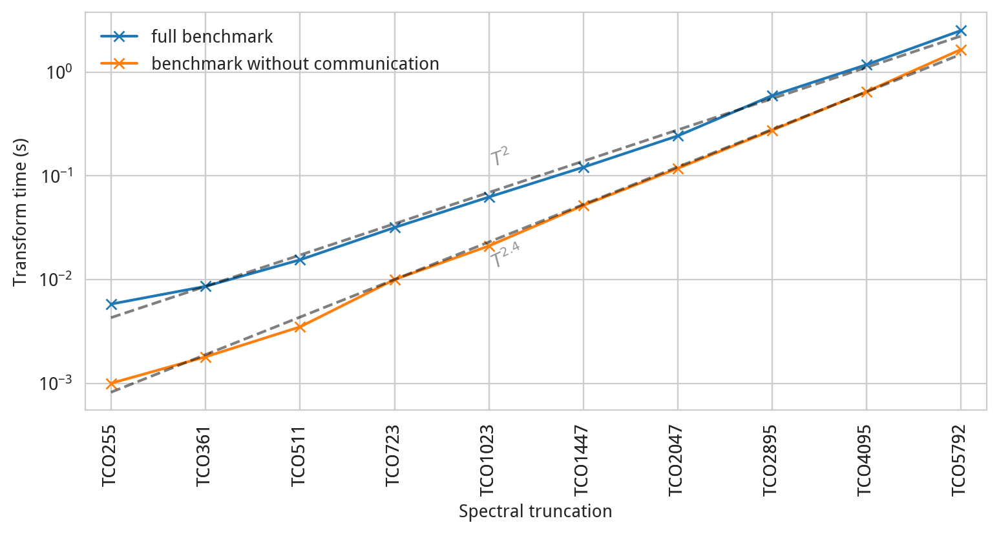

A ["benchmark driver" program](https://sites.ecmwf.int/docs/ectrans/sourcefile/ectrans-benchmark.
f90.html) is bundled with ecTrans. This program performs a loop of inverse and
direct spectral transforms over and over a specified number of times and collects timing statistics
to provide an assessment of the overall performance of ecTrans. It is designed to mimic the use of
ecTrans from within the IFS atmospheric model, in which inverse and direct spectral transforms are
carried out on every model timestep. The benchmark program also includes a simple error checking
algorithm for verifying that the transforms are performing with correct numerics. This latter
feature is in fact used for the ecTrans CTest suite.

Here we describe how to write a benchmark suite for ecTrans.

## Installing ecTrans

First follow the [instructions for installing ecTrans](installation.html) on your system. Verify
that the benchmark programs (one for single and double precision) exist in your build's bin
directory. You should see

```bash
ectrans-benchmark-cpu-sp  ectrans-benchmark-cpu-dp
```

Here we assume you have only enabled the `CPU` feature of ecTrans (which is on by default). If you
also enabled the `GPU` feature, you'll also see GPU versions of these two programs. We'll just focus
on CPUs here.

In this guide we will only benchmark the single-precision build of ecTrans.

## Using the benchmark program

The benchmark program has many arguments for running ecTrans in different configurations. You can
see the full set by running one of the benchmark programs with the `--help` option:

```text
NAME    ectrans-benchmark-cpu-sp

DESCRIPTION
        This program tests ecTrans by transforming fields back and forth between spectral
        space and grid-point space (single-precision version)

USAGE
        ectrans-benchmark-cpu-sp [options]

OPTIONS
    -h, --help          Print this message
    -v                  Run with verbose output
    -t, --truncation T  Run with this triangular spectral truncation (default = 79)
    -g, --grid GRID     Run with this grid. Possible values: O<N>, F<N>
                        If not specified, O<N> is used with N=truncation+1 (cubic relation)
    -n, --niter NITER   Run for this many inverse/direct transform iterations (default = 10)
    -f, --nfld NFLD     Number of scalar fields (default = 1)
    -l, --nlev NLEV     Number of vertical levels (default = 1)
    --vordiv            Also transform vorticity-divergence to wind
    --scders            Compute scalar derivatives (default off)
    --uvders            Compute uv East-West derivatives (default off). Only when also --vordiv is given
    --flt               Run with fast Legendre transforms (default off)
    --nproma NPROMA     Run with NPROMA (default no blocking: NPROMA=ngptot)
    --norms             Calculate and print spectral norms of transformed fields
                        The computation of spectral norms will skew overall timings
    --meminfo           Show diagnostic information from FIAT's ec_meminfo subroutine on memory usage, thread-binding etc.
    --nprtrv            Size of V set in spectral decomposition
    --nprtrw            Size of W set in spectral decomposition
    -c, --check VALUE   The multiplier of the machine epsilon used as a tolerance for correctness checking

DEBUGGING
    --dump-values       Output gridpoint fields in unformatted binary file
```

Some of these options (e.g. `-nprtrv`) require a detailed understanding of how fields are
distributed across MPI tasks, so we won't describe them in detail here. The most important arguments
are the following:

- `-t, --truncation T`: this sets the overall resolution of the benchmark. The truncation T refers  
  to the highest zonal and total wavenumber that can be kept in spectral space. By default, a  
  suitable grid point resolution (i.e. a suitable number of latitudes on the octahedral grid) will  
  be chosen for spectral space. This single number then determines the overall problem size of the  
  spectral transform.  The higher this number, the larger the problem size. As of August 2024, the  
  "HRES" (high-resolution, deterministic) forecast of ECMWF uses a spectral truncation of 1279,  
  combined with an octahedral grid of 2560 latitudes, which gives a grid point resolution of  
  approximately 8 km.
- `-n, --niter NITER`: this determines how many iterations to perform in the spectral transform.  
  The more interations you perform, the more reliable the timing statistics you gather. Note that  
  two additional iterations are always performed at the start. This is because (at least for the  
  GPU version of ecTrans) the first two iterations include some initialisation costs which  
  shouldn't be included in any timing statistics.
- `-l, --nlev NLEV`: this determines the number of vertical levels for three-dimensional fields  
  such as U and V wind (or vorticity and divergence). ecTrans can operate on a batch of vertical  
  levels with a single call and this determines the size of this batch (though by default, fields  
  are distributed across MPI tasks on the vertical dimension at some stages in the spectral  
  transform)
- `--vordiv --scders --uvders`: these options enable some auxiliary code paths when calling the  
  inverse transform. `--vordiv` calculates grid point vorticity and divergence, `--scders`  
  calculates derivatives of scalar fields in grid point space, and `--uvders` calculates gradients  
  of the U and V wind in grid point space. For testing code changes, it's good to include these  
  options so as many code paths as possible are verified.
- `--norms`: this option enables error norms, which are printed aggregated over all fields at the  
  end of the benchmark. The errors are computed in spectral space with respect to the initial  
  values of the fields. This is useful to get a good idea that the benchmark is numerically  
  correct.
- `--meminfo`: this option enables so-called "meminfo" diagnostics, which are printed at the end of
  the benchmark. These diagnostics include memory usage on a per-task basis. Thread binding
  information is also printed which can be extremely useful when debugging performance issues when
  running ecTrans multithreaded.

Putting all of these together, we get the following invocation of the ecTrans benchmark program:

```
./ectrans-benchmark-cpu-sp --truncation 159 --niter 100 --nlev 137 --vordiv --scders --uvders --norms --meminfo
```

## Designing a scalability test

As mentioned above, the single most important parameter for determining the problem size, and
therefore computational cost, of a benchmark of ecTrans is the spectral truncation, controlled with
the `-t, --truncation` argument. With this single parameter we can construct a scalability
benchmark. Here we demonstrate an example scalability test carried out on the ECMWF high-performance
computer ("HPC2020"). This will be a "strong-scaling" test, in which the allocation of computational
resources is fixed and the problem size is increased. The tests will use 80 nodes and the problem
size will be increased using the truncation parameter only. All other arguments to the benchmark
program are as specified in the previous section.



The figure above shows how the median time of a combined inverse-direct spectral transform scales
with the truncation parameter. This number is printed at the end of the benchmark program under the
`Inverse-direct transform` heading (look for `med  (s)`). Results are shown both for an ordinary
configuration of ecTrans, and a special benchmarking case where communication is disabled. The
latter case is set by replacing the call of the "transposition" communication routines subroutines
`TRGTOL`, `TRLTOG`, `TRLTOM`, `TRMTOL` with logic to simply zero the communication buffer. (Note
that the names of these subroutines are abbreviations for "transposition from G space to L space"
etc., where G, L, and M refer to different decompositions employed by ecTrans at different stages of
a transform.) This artificial configuration of course breaks the numerical validity of the
transform, but it does permit us to measure the scalability of the computational aspects of ecTrans
in isolation.

Interestingly, the full benchmark (including communication) seems to show quadratic scalability
while the benchmark without communication shows scalability with an exponential more like 2.4. There
isn't a simple formula for the purely computational complexity of ecTrans as the total number of
floating-point operations in both the Fourier and Legendre transforms is a complicated summation of
fast Fourier transforms (usually \(n\log n\) complexity) and matrix-vector multiplications (usually
\(n^3\) complexity) of different sizes. Nevertheless, we should expect a scaling exponent between
2 and 3, with the exact value differing depending on whether the Fourier or Legendre transform
dominates. As the truncation is increased, we can see that the computation becomes a larger
proportion of overall wall time, and the two lines will likely converge around TCO10000. However,
the exact nature of this convergence will depend sensitively on the number of nodes allocated.

As demonstrated in this example, ecTrans is not only fascinating object for scalability studies,
combining paradigms of computation and communication, but is an easy target thanks to the benchmark
program which permits arbitrary scaling of the problem size.