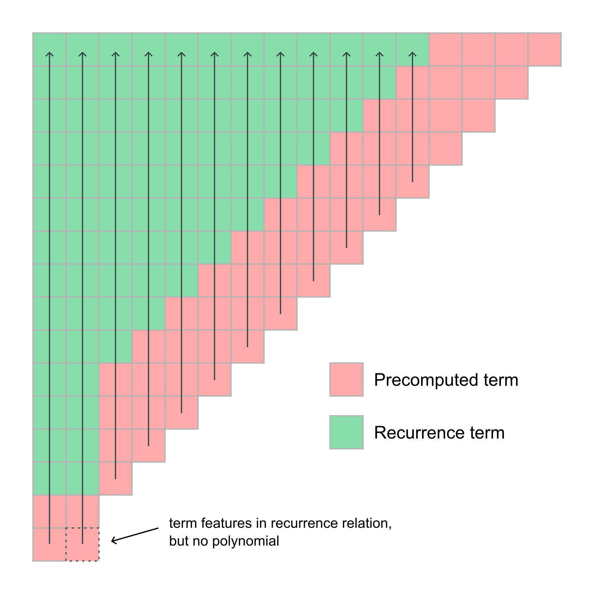

@warning
Page under construction.
@endwarning

In order to perform the Legendre polynomials, ecTrans precomputes and stores the associated Legendre
polynomials. Following convention, this is done using a recurrence relation. In fact, we use several
recurrence relations depending on the mode of the polynomial which is being generated, refined over
several decades of experience.

Here we summarise in mathematical notation the recurrence formulae followed by the relevant
subroutine, [`SUPOLF`](https://sites.ecmwf.int/docs/ectrans/sourcefile/supolf_mod.f90.html). This
subroutine takes in a zonal wavenumber and a single abscissa (i.e. a single value of the sine of
latitude) and returns an array corresponding to the associated Legendre polynomial values for all
total wavenumbers valid for that zonal wavenumber evaluated at the given abscissa coordinate. As
always, a triangular truncation is used, such that the highest total wavenumber that a polynomial is
evaluated at is the same as the zonal wavenumber truncation.

Now we describe how the polynomial array, \( P_{m,n}(\mu) \) is filled, where \( m \) is the zonal
wavenumber, \( n \) is the total wavenumber, and \( \mu \) is the sine of the latitude. The
recurrence relation used is different depending on \( m \). This figure gives a flavour of the
algorithm employed:

### \( m = 0 \) case

\[
\begin{align*}
d_0 &= 1, &P_{0,0}(\mu) = d_0\\
d_1 &= \mu, &P_{0,1}(\mu) = \sqrt{3}d_1\\
d_n &= \frac{2n-1}{n}\mu d_{n-1} - \frac{n-1}{n}d_{n-2}, &P_{0,n}(\mu) = d_n\sqrt{2n+1}
\end{align*}
\]

### \( m = 1 \) case

\[
\begin{align*}
d_0 &= 1\\
d_1 &= \mu, &P_{1,1}(\mu) = \sqrt{\frac{3}{2}(1 - \mu^2)}\\
d_n &= \frac{2n-1}{n}\mu d_{n-1} - \frac{n-1}{n}d_{n-2}, &P_{1,n}(\mu) = n\frac{(d_{n-1} - \mu d_n)}{\sqrt{1-\mu^2}}\sqrt{\frac{2n+1}{n(n+1)}}
\end{align*}
\]

### \( m >= 2 \) case

For higher order polynomials, the situation is more complicated. We begin by calculating the first
4 terms using explicit formulae. The general expression for these 4 terms is

\[
P_{m,m+j}(\mu) = (1 - \mu^2)^{m/2}d_j\sqrt{\frac{(2(m+j)+1)j!}{\prod_{j'=0}^j (2m+j')}}, j = 0...3
\]

Here, the \( {d_j} \) are calculated according to the following:

\[
\begin{align*}
p_0 &= \sqrt{2m-1}\prod_{n=1}^{m-1}\sqrt{\frac{2n-1}{2n}}, &d_0 = p_0\\
p_1 &= (2m+1)p_0, &d_1 = \mu p_1\\
p_2 &= p_1, &d_2 = \frac{1}{2}p_2((2m+3)\mu^2 - 1)\\
p_3 &= (2m+3)p_2, &d_3 = \frac{1}{6} \mu p_3((2m+5)\mu^2 - 3)
\end{align*}
\]

The remaining terms are computed with the following recurrence relation:

\[
P_{m,n}(\mu) = \frac{(\mu^2 - f_1(m,n-2))P_{m,n-2}(\mu) - f_2(m,n-4)P_{m,n-4}(\mu)}{f_2(m,n-2)}
\]

with the following convenience formulae:

\[
f_1(m,n) = \frac{2k(k+1) - 2m^2-1}{(2k-1)(2k+3)}
\]

and

\[
f_2(m,n) = \sqrt{\frac{(k-m+1)(k-m+2)(k+m+1)(k+m+2)}{(2k+1)(2k+3)^2(2k+5)}}
\]