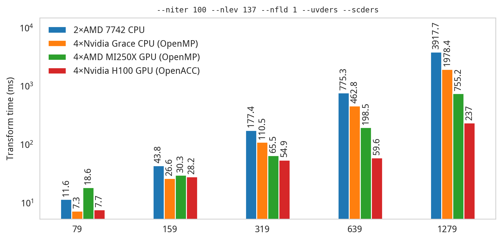

ecTrans contains GPU variants of both the global and local spectral transforms (referred to as
`trans` and `etrans`, respectively, in the source tree). GPU acceleration is provided through a
combination of directive-based programming and external GPU-compatible numerical libraries. For
example, the computation of north-south derivatives for the global transform is carried out with
directive-decorated Fortran since it is quite simple, whereas the Fourier transform part is carried
out through cuFFT or hipFFT, depending on the targeted device.

Although the design of ecTrans is intended to be vendor-agnostic, in practice we only support two
flavours of GPU at present: Nvidia and AMD. For running on the former, we use OpenACC offloading
and cuBLAS/cuFFT. For running on the latter, we use OpenMP offloading and hipBLAS/hipFFT.

GPU capability is controlled through a combination of different CMake features at configure time.
Not all combinations are valid, and here we present an overview of how to properly configure ecTrans
for targeting GPUs.

## Configuring ecTrans for GPUs

The first feature to consider is `GPU`. To enable GPU support, first declare the variable
`ENABLE_GPU=ON` (e.g. if calling the configure step on the command line with `cmake`, pass
`-DENABLE_GPU=ON`). This feature should always be declared along with an offload mode, either `ACC`
for OpenACC or `OMP` for OpenMP. We recommend always using OpenMP offload when targeting AMD devices
and OpenACC offload when targeting Nvidia devices. It is possible to use OpenACC on AMD devices with
the Cray compiler, but we do not recommend it. We do not support OpenMP offload on Nvidia devices at
all though it is possible to enable it at configure time. We also do not yet support OpenMP offload
for the limited-area spectral transform ("`etrans`"). 

When the `GPU` feature is enabled, CMake will automatically look for either CUDA or HIP. One of
these must be present in order to configure ecTrans with `GPU` enabled.

In most cases, that is all that's required to configure ecTrans for targeting GPUs. A number of
additional CMake features allow one to control the behaviour of the spectral transform
on GPU, and these are detailed in [CMake Features](cmake_features.html).

## Benchmarks

Generally speaking, ecTrans is significantly faster when executed on GPUs, compared with CPUs. The
chart below gives single-node benchmarks of ecTrans on three different systems of interest: the
current HPC system of ECMWF (with 2 AMD 7742 Rome CPUs per node), LUMI-G (with 4 AMD MI250X GPUs per
node), and JUPITER (with 4 GH200 Grace Hopper superchips per node, and results given for both Grace
only and Hopper only). The chart shows the median time to perform one combined inverse-direct
global spectral transform at various spectral resolutions with a standard complement of fields (412)
and with some common features enabled. The transform time when using 4 Hopper GPUs is around 17×
faster than on 2 AMD Rome CPUs.

