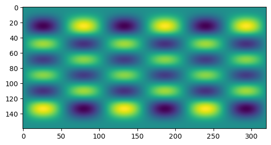

# Usage

Here we describe how to construct from scratch a minimal working program that uses ecTrans. The
instructions here assume you have already installed FIAT and ecTrans according to
[our instructions](installation.html). Therefore, in the current directory you should see fiat/build
and ectrans/build.

@note
The full program described here can be found in the docs/examples/ectrans_demonstrator of the
[ecTrans repository](https://github.com/ecmwf-ifs/ectrans/).
@endnote

## Getting started

We begin with the simplest Fortran program that calls an ecTrans subroutine:

```f90
PROGRAM ECTRANS_DEMONSTRATOR

IMPLICIT NONE

#include "setup_trans0.h"

CALL SETUP_TRANS0(LDMPOFF=.TRUE.)

END PROGRAM ECTRANS_DEMONSTRATOR
```

Save this in a file called ectrans_demonstrator.F90.

In order to use ecTrans within a Fortran program, you must include the header files corresponding to
the subroutines you intend to call. Only some of the ecTrans subroutines are callable from an
external program and we refer to these as the "external" subroutines. They are documented on the
[API page](api.html). Each external subroutine exists in its own source file with its own header
file. The header files contains an `INTERFACE` block so the compiler knows what the signature of the
subroutine is. The `#include` statements must be placed between the `IMPLICIT NONE` and the main
body of the source code. Add `#include` statements for the other routines we will be using:

```f90
#include "setup_trans.h"
#include "inv_trans.h"
#include "dir_trans.h"
#include "trans_inq.h"
```

All arguments to `SETUP_TRANS0` are optional, so for now let's just provide one: `LDMPOFF` which
turns off MPI. This means we don't have to build with MPI support for this simple test.

We can now try building our program just to see if it at least runs.

## Building our program with CMake

CMake might seem overkill for a simple program, but we find it is still easier than manually
crafting a Makefile. Since ecTrans is built with CMake, much of the hard work has already been done.

Here is a minimal toplevel CMakeLists.txt for this guide:

```cmake
cmake_minimum_required( VERSION 3.12 FATAL_ERROR )

project( ectrans_demonstrator LANGUAGES Fortran )

find_package( fiat REQUIRED )
find_package( ectrans REQUIRED )

add_executable( ectrans_demonstrator ectrans_demonstrator.F90 )

target_include_directories( ectrans_demonstrator 
                            PRIVATE ${CMAKE_SOURCE_DIR}/ectrans/src/trans/include/ectrans )
target_include_directories( ectrans_demonstrator PRIVATE ${fiat_ROOT}/module/parkind_sp )
target_link_libraries( ectrans_demonstrator PRIVATE trans_sp )
```

ecTrans supports single- and double-precision arithmetic. Currently you must decide which one you
want to use at compile time, as there is a separate library for each kind. Here we link against the
single-precision library which means all `REAL` variables passed to `INV_TRANS` and `DIR_TRANS` must
be single precision. 

With this file you can follow the standard procedure for configuring and building with CMake:

```bash
mkdir build && cd build
cmake .. -Dfiat_ROOT=../fiat/build -Dectrans_ROOT=../ectrans/build
make
```

Now try running the program with `./ectrans_demonstrator`. You should see output like the following:

```
ecTrans at version: 1.3.2
commit: 023f5e320846f7a2ef538166366f68ce2046efa1
```

## Building our program without CMake

It is still possibly to build ecTrans without CMake by manually writing a Makefile. As with any
library, we have to ensure all header and module files referenced are on the include path and the
ecTrans library is included at the link time of the program. That looks like this:

```Makefile
FC = <your compiler>
ECTRANS_INC = /path/to/ectrans/build/include/ectrans
FIAT_MOD = /path/to/fiat/build/module/fiat
ECTRANS_LIB = /path/to/ectrans/build/lib

ectrans_demonstrator: ectrans_demonstrator.o
        $(FC) $^ -o ectrans_demonstrator -L$(ECTRANS_LIB) -lectrans_sp -lectrans_common

ectrans_demonstrator.o: ectrans_demonstrator.F90
        $(FC) -c ectrans_demonstrator.F90 -o ectrans_demonstrator.o -I$(FIAT_MOD) -I$(ECTRANS_INC)
```

As when building with CMake, we link against the single-precision version of the ecTrans library.

## Setting up ecTrans

When passing and receiving variables from ecTrans subroutines, you should declare variables with a
`KIND` parameter taken from the `PARKIND1` module (part of FIAT). In this program we need the 4-byte
float type `JPRM` and a 4-byte integer type `JPIM`. Import both of these from the `PARKIND1` module
before proceeding:

```f90
USE PARKIND1, ONLY: JPRM, JPIM
```

Now let's make our program more interesting. Let's use ecTrans to visualise some of the spherical
harmonics! We will use a spectral truncation of 79 which corresponds to a full Gaussian grid with 
160 latitudes and 320 points per latitude. Add an integer parameter (remember, with kind `JPIM`) at
the top of the file called `TRUNC` with value 79. Then add a call to `SETUP_TRANS` so that
everything is initialised. We can rely mostly on the default parameters, but we always need to
provide `KSMAX`, the spectral truncation, and `KDGL`, the number of Gaussian latitudes pole to pole:

```f90
CALL SETUP_TRANS(KSMAX=TRUNC, KDGL=2 * (TRUNC + 1))
```

## Initialising work arrays

Now we need to allocate arrays to store our fields in spectral space and grid point space. As
mentioned earlier, all variables passed to `INV_TRANS` and `DIR_TRANS` must be single precision in
this test. These arrays will be `ALLOCATABLE`, but what sizes should we allocate for them? We can
use the `TRANS_INQ` subroutine to learn what the relevant dimensions are that correspond to a
spectral truncation of 79:

```f90
CALL TRANS_INQ(KSPEC2=NSPEC2, KGPTOT=NGPTOT)
```

Make sure you declare `NSPEC2` and `NGPTOT` as `INTEGER(KIND=JPIM)`. `KSPEC2` gives us the number of
elements in a spectral space array and `NGPTOT` gives us the total number of grid points that
corresponds to this spectral space array. `NSPEC2` should take a value of 6480,
which is \( 2\times(N+1)(N+2)/2 \), where \(N\) is the truncation (79), the first factor of two is
because spectral coefficients have an imaginary and real part and the division by two is because
ecTrans assumes all grid-point space variables are real. That means the negative zonal modes in
spectral space must be the complex conjugates of the positive ones, so we don't need to store them
explicitly. This reduces the number of coefficients by half. `NGPTOT`, more simply, should simply
have the product of the number of latitudes and the number of points per latitude, i.e. 51200. I
recommend you verify that's the case.

Now we introduce the two arrays. First, declare them at the top:

```f90
REAL(KIND=JPRM), ALLOCATABLE :: SPECTRAL_FIELD
REAL(KIND=JPRM), ALLOCATABLE :: GRID_POINT_FIELD
```

and allocate them down below:

```f90
ALLOCATE(SPECTRAL_FIELD(1,NSPEC2))
ALLOCATE(GRID_POINT_FIELD(NGPTOT,1,1))
```

The first dimension of `SPECTRAL_FIELD` is the "fields" dimension, which allows one to transform
multiple fields in one go. ecTrans is designed to efficiently transform many fields with a single
call, but here we're just transforming one. The second dimension of `GRID_POINT_FIELD` has the same
function. The third dimension of `GRID_POINT_FIELD` exists for compatibility with the arrays
expected by the IFS (the main user of ecTrans), which are "blocked" according to a standard "NPROMA"
style. Here for simplicity we just set it to one.

Now we need to put some numbers in `SPECTRAL_FIELD` so we have something interesting to transform.
Let's just pick one of the spectral coefficients and set that to one, and all the others to zero.
We will pick the mode \( (m,n) = (3,8) \). The following will accomplish this:

```f90
CALL TRANS_INQ(KASM0=SPECTRAL_INDICES)

M = 3
N = 8

I = SPECTRAL_INDICES(M) + 2 * (N - M) + 1

SPECTRAL_FIELD(:,:) = 0.0
SPECTRAL_FIELD(1,I) = 1.0
```

Remember to declare `M`, `N`, and `I` as integers at the top. You should declare
`SPECTRAL_INDICES` as an integer array with dimension `(0:TRUNC)`, The `KASM0` argument to
`TRANS_INQ` returns an array which gives the offset into spectral arrays corresponding to the given
zonal wavenumber. Then, we count up by `N - M` elements to get to the element corresponding to the
given total wavenumber `N`. The factor of two accounts for the fact that spectral coefficients have
two components, real and imaginary.

## Performing an inverse spectral transform

Now we're ready to perform a spectral transform. Add a call to `INV_TRANS`:

```f90
CALL INV_TRANS(PSPSCALAR=SPECTRAL_FIELD, PGP=GRID_POINT_FIELD)
```

That's it! Now we can visualise `GRID_POINT_FIELD` to see what it looks like. Dump it to an
unformatted binary file so we can open it with Numpy:

```f90
OPEN(7, FILE="grid_point_field.dat", FORM="UNFORMATTED")
WRITE(7) GRID_POINT_FIELD(:,1,1)
CLOSE(7)
```

Finally you can use this simple Python script to plot the field:

```py
import numpy as np
import matplotlib.pyplot as plt
data = np.fromfile("build/grid_point_field.dat", dtype="float32")[1:-1].reshape((160,320))
plt.imshow(data)
plt.savefig("plot.png", bbox_inches="tight")
```

You should get a plot like this:



That's it! ecTrans is quite an intimidating package at first, but almost all the complexity comes
from the parallel aspects. For performing a simple serial spectral transform it's quite simple.

## Performing a direct spectral transform

To close the loop, we can now add a direct transform back to spectral space. Let's do that into
a new spectral field array, and compare it with the original. Hopefully they will be equivalent
within a tolerable error margin. Declare another allocatable variable `SPECTRAL_FIELD_2` and
allocate it the same way as with `SPECTRAL_FIELD`. Now call `DIR_TRANS` like this:

```f90
CALL DIR_TRANS(PGP=GRID_POINT_FIELD, PSPSCALAR=SPECTRAL_FIELD_2)
```

and compute the error between the first and second spectral field arrays:

```f90
WRITE(*,*) "Error = ", NORM2(SPECTRAL_FIELD_2 - SPECTRAL_FIELD)
```

You should get an error of \( O(10^{-7}) \) which is roughly the machine epsilon of the
single-precision float type \( 2^{-23} \approx 10^{-7} \). This concludes the demonstration.
